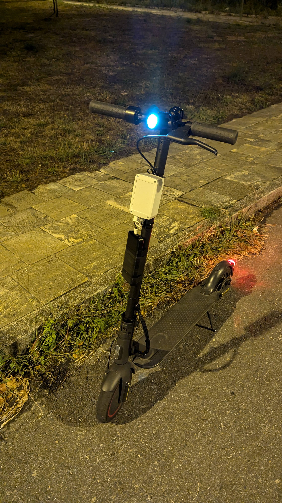

# Xiaomi E-Scooter IoT Monitoring System with 4G & Remote Control

    <picture>
        
    </picture>
     
    <strong>🛴 Realtime Xiaomi Scooter Monitoring and Control using a Raspberry Pi, GPS and 4G</strong>
     
     
     
    

An open-source IoT solution designed to monitor and control your Xiaomi e-scooter in real-time using a Raspberry Pi, GPS, and 4G connectivity.

This project is my Computer Science final year project at the University of A Coruña. 

> **Disclaimer:** Although the project is fully functional, the code quality may not be top-tier, as this was my first time coding in Rust. My background is in Systems Administration and Infrastructure, not software development.

The project has been tested on the Xiaomi Mi Pro 2 scooter but should be compatible with the following models: m365, Mi Lite 1S, Mi Pro, Mi Pro 2, and Mi Pro 3.

Part of the code comes from the [m365](https://github.com/macbury/m365) repository and the [CamiAlfa Reverse Engineering work](https://github.com/CamiAlfa/M365-BLE-PROTOCOL).

## 🎯 Functionalities 

- **Real-Time Data Monitoring using Grafana:** View live telemetry from your e-scooter, including speed, trip distance, uptime, total odometer, estimated range left, battery status (capacity, percentage, voltage, current, temperature), and GPS location via a Grafana dashboard.

- **Remote Control:** Disable your scooter remotely using a relay.

- **LTE and GPS Connectivity:** Stay connected wherever you go, with 4G modem and GPS integration.

- **Third Party integration:** Integrate your scooter with platforms like [Home Assistant](https://www.home-assistant.io/) using the API. 

- **Own your data:** All infrastructure is self-hosted, allowing you to maintain complete ownership of your data.

- **Automatically switch between 4G and Wi-Fi:** Save up on your data plan by using Wi-Fi when it is available.

## 🏗️ Architecture

  

## Hardware and Software 

**🛠️ Hardware:**

- Raspberry Pi Zero 2W
- [Waveshare SIM7600G-H 4G HAT](https://www.waveshare.com/wiki/SIM7600G-H_4G_HAT_(B))
- 5V Relay
- [Xiaomi Dashboard Cable Connector](https://es.aliexpress.com/item/1005006358377128.html)
- SIM Card for LTE connection
- SD Card for Raspberry Pi
- External Battery
- Electrical register box.

I attempted to power the Raspberry Pi using the scooter’s battery, but due to its high power consumption, this was not feasible. It may be possible with a microcontroller.

> **Why did I use a Raspberry Pi?:**
 Given my tight deadline (2.5 months over the summer), I chose the Raspberry Pi because it supports Rust, allowing me to reuse parts of the m365 library. Although a microcontroller would be better suited due to the lower energy consumption, it would have required rewriting the code in C, which was not feasible in such a short time frame. 

**💻 Software:**

- Raspberry Pi OS Lite 64-bit
- Python (Paho-MQTT, FastAPI, SQLAlchemy)
- Grafana (Data visualization)
- TimescaleDB (PostgreSQL extension for time series data) + PostGIS
- Docker and Ansible (Server deployment)
- Tailscale (Optional VPN for secure access)

## 🔧 Installation Guide

1. **Deploy the server**. Follow the [server documentation](./server/README.md).

2. **Compile the client (optional) and obtain the scooter's MAC and pairing token:** Detailed instructions can be found in the [client guide](./client/README.md)

3. **Set up the Raspberry Pi client and start it** Connect the relay to the scooter and install the monitoring client.
For further details, refer to the [Raspberry setup guide](./raspberry/README.md).

  
  

## 📋 Motivation

I enjoy tinkering with Raspberry Pi (and other hardware) and data visualization. A few years ago, I used a Bird rental scooter and was curious about how it worked. When I needed to choose a topic for my thesis, I remembered that experience and decided to build my own scooter monitoring system.

While researching, I found very few DIY projects that were user-friendly, so I aimed to create something accessible for anyone interested in monitoring and using their scooter's data.

## 🚀 Future Development Ideas

- **Secure the API:** Due to time constraints, the API currently lacks security measures. Future updates might include instructions on setting up an API Gateway or other security methods.

- Add a **reverse proxy** to expose the server components securely on the internet without a VPN.

- Add support for **multiple users and scooters** on the same server.

- Add support for **other types of vehicles** (cars, bikes, other scooter models).

- Obtain data using the scooter's serial connection using a cable to avoid possible Bluetooth interference.

- **Reimplement the client on a microcontroller** for lower power consumption.

## 🤝 Contributing

If you have suggestions, bug fixes, or ideas for improvements, feel free to open an issue or submit a pull request. Contributions are welcome!

##  References

This project uses parts of the code from the [m365](https://github.com/macbury/m365) library to handle cryptography, connection and data collection from the scooter.
These portions of the code remain mostly unchanged, with minor fixes for data conversion, as detailed in this [Github Pull Request](https://github.com/macbury/m365/pull/2).

The project also relies on the reverse-engineered protocol from [CamiAlfa](https://github.com/CamiAlfa/M365-BLE-PROTOCOL).

I am deeply grateful to both developers for their work, which was essential to the success of this project.

## 📄 License

The AGPL-3 license 2024 - [Martín G](https://github.com/martinge17)
