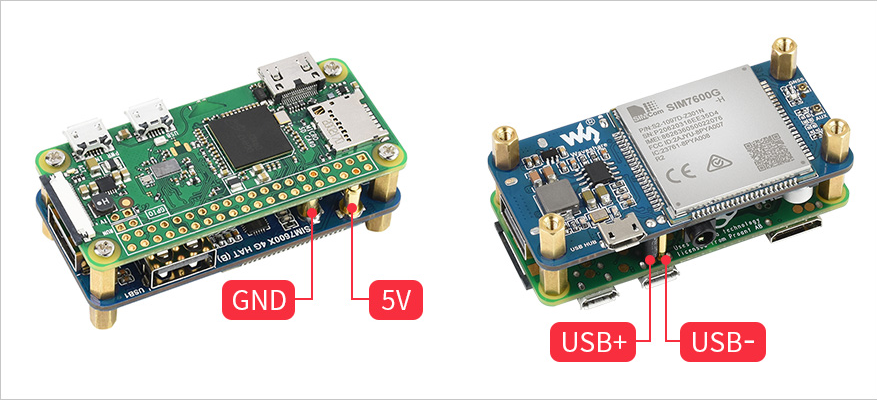
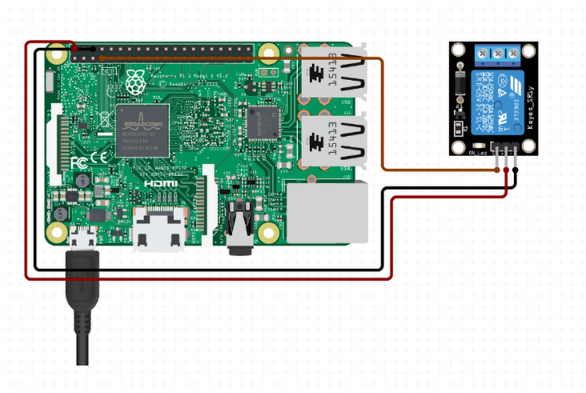
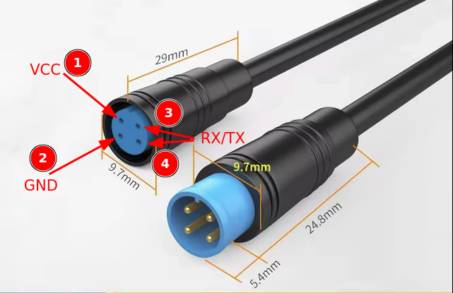

# Raspberry Pi Installation Guide

This guide walks you through setting up the Raspberry Pi and required hardware to run the e-scooter monitoring system.

## Table of contents

- [Prerequisites](#prerequisites)
- [Raspberry Pi OS Installation](#raspberry-pi-os-installation)
- [Initial Raspberry Pi Hardware Setup](#initial-raspberry-pi-hardware-setup)
- [Relay Connection with the Scooter](#relay-connection-with-the-scooter)
- [Final Software Installation](#final-software-installation)

## Prerequisites

This setup makes use of the following components:

- Raspberry Pi Zero 2W
- [Waveshare SIM7600G-H 4G HAT](https://www.waveshare.com/wiki/SIM7600G-H_4G_HAT_(B))
- 5V Relay
- [Xiaomi Dashboard Cable Connector](https://es.aliexpress.com/item/1005006358377128.html)
- SIM Card
- MicroSD card for the Raspberry Pi.
- [Raspberry Pi Imager](https://github.com/raspberrypi/rpi-imager)
- (Optional) [Tailscale](https://tailscale.com/)

**Tip:** I used Tailscale to connect the Raspberry to the server. It's simple and effective, but you can also set up your own VPN server if you prefer.

## Raspberry PI OS Installation

> **Note:** For this setup, the Raspberry Pi OS uses the `scooter` username and `martinete` hostname. If you wish to change these, you'll need to modify the configuration scripts and service files.

Follow these steps to install Raspberry Pi OS with the appropriate settings:

1. Download and install [Raspberry Pi Imager](https://github.com/raspberrypi/rpi-imager).
2. Open Raspberry Pi Imager and:
   - Select **Raspberry Pi OS Lite 64-bit** as the operating system.
   - Click on `Edit Settings` before installation to:
     - Set the hostname to `martinete`
     - Set the username to `scooter`
     - Configure Wi-Fi credentials
     - Enable SSH access
3. Save the settings and proceed with installation.
4. Once installed, power on the Raspberry Pi and connect to it via SSH.

### Post-Installation Steps:

1. Install the updates
    ```bash
    sudo apt update && sudo apt upgrade
    ```

2. *(Optional)* Setup Tailscale for remote access [following this guide](https://tailscale.com/download/linux/debian-bookworm).


## Initial Raspberry Pi Hardware Setup

Once Raspberry Pi OS is installed, connect the hardware components.

### 1. Install the Waveshare SIM7600G-H 4G HAT

- Physically attach the HAT to the Raspberry Pi.
- Insert the SIM card.

<p align="center">
    
</p>

**💡 Tip:** The thimble connectors of the HAT may not make proper contact with the RPI GPIO. If the HAT doesn't power or, solder a [pin header](https://en.wikipedia.org/wiki/Pin_header) on the 5V and GND GPIO pins to ensure a stable connection.

### 2. Wire the 5V Relay

- Attach the relay to the Raspberry Pi using the 5V, GND, and a free GPIO pin (e.g., pin 23). Modify the [relay config file](./relay_mqtt_client/relay.toml) to match the pin.
- Refer to this [Raspberry Pi GPIO pinout guide](https://pinout.xyz/) and the [relay example](https://www.circuito.io/app?components=9443,200000,3061987).

<p align="center">
    
</p>

Before continuing with the software installation, connect the relay to the scooter.

## Relay connection with the scooter

To be able to remotely deactivate the scooter we need to connect the relay to the dashboard-to-control unit data lines. Using [spare Xiaomi connectors](https://es.aliexpress.com/item/1005006358377128.html) will help avoid damaging the original wires.

### Connector Pinout:
- **VCC:** Carries power (40V)
- **RX/TX:** Transmits data between the dashboard and control unit.
- **GND:** Ground wire.

<p align="center">
    
</p>

### Steps to Connect:

After testing the pins manually, I discovered that disconnecting one of the RX or TX lines (blue and green connector wires) causes the scooter to stop functioning. Based on this, here's how to prepare the spare connectors:

1. **Join the Red, Yellow and Green wires:**
Use a terminal block connector (or solder the wires) to connect the red, yellow, and green wires from both sides of the spare connector.

2. **Wire the blue wires to the relay**
    - Connect one end of the blue wire to the "COM" (Common) terminal on the relay.
    - Connect the other end to the "Normally Closed" (NC) terminal. 

> **🔍 What does "Normally Close" mean?**
    It means that, when the relay is not powered, the connection between the two endpoints remains closed, allowing current to pass. You can learn more about Normally Closed vs. Normally Open [here](https://engineerfix.com/electrical/circuits/normally-open-vs-normally-closed-what-do-they-mean/).

> **🤔 Why use Normally Close?:** 
    During development, using the Normally Closed setup made testing easier. Even if the Raspberry Pi lost power, the scooter could still function normally. If you'd prefer to use the "Normally Open" (NO) configuration, simply connect the wire to the "NO" terminal and adjust the [relay python script](./relay_mqtt_client/relay.py) accordingly.


3. **Unscrew the handlebar to access the connector**
4. **Disconnect the original cable and plug the modified one.**

Verify that the scooter turns on correctly before proceeding.

### 💥🔥🚨 Safety Notice 🚨🔥💥

Since this is a prototype, the relay connections are not fully insulated and could disconnect due to vibrations. Once you confirm everything works, secure the wires with hot glue at the relay terminals to prevent accidental disconnections.

## Final software installation

With the relay wired and tested, you're ready to install the software. Follow the instructions in the [scripts folder README](./scripts/README.md) to continue.

After completing the setup, turn on the scooter. The Raspberry Pi should automatically connect to it, and data should start being transmitted to the MQTT broker.


