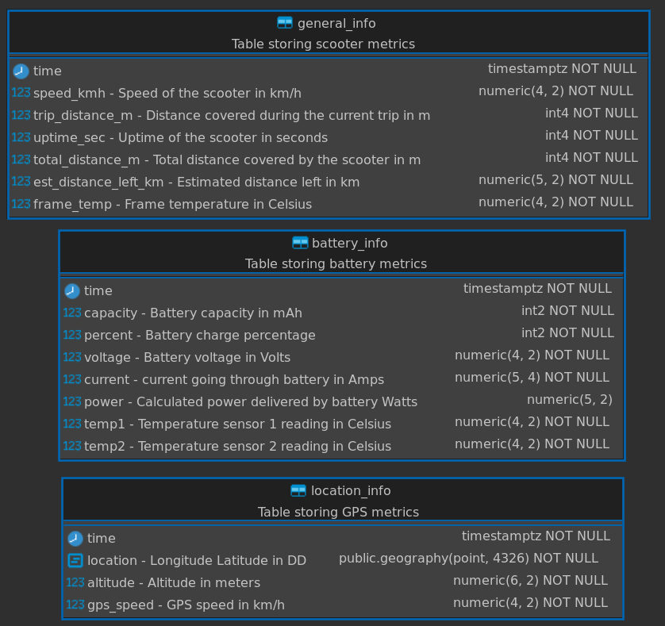

# TimescaleDB

For the database I use [TimescaleDB](https://www.timescale.com/) with the [PostGIS extension](https://postgis.net/) extension, used for managing location data.

## Why TimescaleDB?

I chose TimescaleDB over other solutions like [InfluxDB](https://www.influxdata.com/) because it is built on PostgreSQL, which offers more tools, documentation, and community support. As I am more familiar with PostgreSQL, it was a better fit for this project.

## Database Structure

The data is stored across three tables as shown below:

    <picture>
        
    </picture>

## ⚙️ Configuration

Before starting the database, ensure all parameters are correctly set in the [db.env](db.env) file.
This file contains credentials for Grafana, FastAPI and the MQTT Bridge.

- User permissions:
    - `admin` and `bridge` users have read/write access.
    - `grafana` and `api` users are read-only for security reasons.

By default, the database stores its data on a Docker Volume. Feel free to customize the [Compose file](../server-compose.yaml) if you prefer to bind local directories to store data.